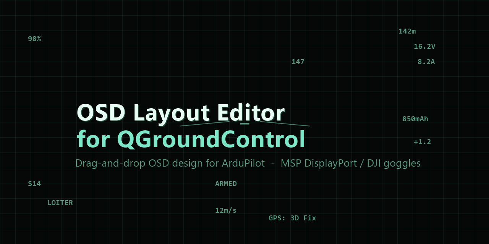
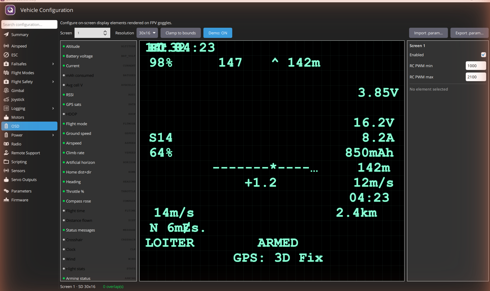

# QGC OSD Layout Editor



A QGroundControl SetupView component that lets users edit ArduPilot
OSD layouts (rendered on DJI O3 / Walksnail / HDZero goggles) directly
inside QGC — replacing the need to switch to Mission Planner.

Instead of hand-editing 75+ cryptic parameters like `OSD1_BAT_VOLT_X = 53`,
you **drag elements onto a grid** and the editor writes the matching
`OSD*` parameters to the flight controller live. It flags overlapping
elements, supports multiple screens/resolutions, and imports/exports
`.param` files.

Built with **C++ / Qt Quick (QML)** as a native QGroundControl plugin,
talking to ArduPilot's `OSD*` parameter family over MAVLink — tested live
against a real Cube flight controller.

## Screenshot

<!-- Replace with your own screenshot: in QGC open Vehicle Config -> OSD,
     click "Demo preview", then Win+PrtScn and save the file as
     docs/screenshot.png (it will show automatically once committed). -->
<!--  -->

_Open the **OSD** page under Vehicle Configuration, drag elements on the
grid, and toggle **Demo preview** to see the full layout with sample
telemetry._

## Status

| Component                          | State        |
| ---------------------------------- | ------------ |
| Data layer (JS)                    | ✅ 27 tests passing |
| Interactive web prototype          | ✅ Works in browser |
| Inline-vs-module parity            | ✅ 6 checks passing |
| QGC C++ controller                 | ✅ Implemented (param IO, overlaps, clamp) |
| QGC QML editor page                | ✅ Renders & works (palette/canvas/inspector) |
| QGC plugin wiring                  | ✅ OSD entry appears in Vehicle Config sidebar |
| Hardware validation                | ✅ Edits OSD params live against a real Cube |
| Upstream PR                        | ⬜ Not started |

See `CLAUDE.md` for live state, working norms, and project conventions
(Claude Code reads it on every session).

## Quick start

```bash
# Run the prototype in browser
npm run serve    # opens http://localhost:8000

# Run all JS tests
npm test

# Read the project map and norms
cat CLAUDE.md
```

## Repo structure

```
qgc-osd-editor/
├── CLAUDE.md            ← persistent context for Claude Code (READ THIS)
├── README.md            ← you are here
├── package.json
├── prototype/           ← working web editor + data layer + tests
├── qgc/                 ← C++/QML scaffolds for the QGC port
├── docs/                ← parameter spec, integration notes, test plan
├── fixtures/            ← realistic .param files for tests
├── scripts/             ← test.sh, serve.sh
└── tasks/               ← seven ordered tasks: prompts for Claude Code
```

## How to work with Claude Code on this

1. Read `CLAUDE.md` to ground yourself
2. Pick a task from `tasks/` — they're numbered in execution order
3. Start a Claude Code session with: "Read `CLAUDE.md` and `tasks/0N-*.md`, then start work"
4. When the task is done, update the status table in `CLAUDE.md`

Each task file lists its preconditions, work, acceptance criteria, and
common pitfalls.

## Why this project exists

ArduPilot already has full DJI O3 OSD support via the `OSDn_*` parameter
family + MSP DisplayPort. Mission Planner has a graphical editor for it.
QGroundControl does not, so users either:

1. Edit raw parameter names (`OSD1_BAT_VOLT_X = 53`) by hand in QGC's
   parameter editor, which is terrible
2. Switch to Mission Planner just for OSD config, which is friction

This component closes that gap inside QGC.

## License

Same as QGroundControl: Apache 2.0 OR GPL-3.0-or-later.

## Credits

- ArduPilot project for the underlying OSD library
- Mission Planner's OSD setup tab as the UX reference
- QGroundControl's existing APM plugin components as architectural reference
